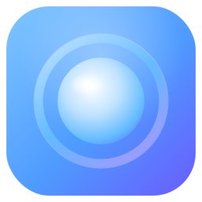

<div align="center">



# Tide

**A Liquid-Glass menu-bar countdown for macOS.**

[](https://www.apple.com/macos/)
[](https://developer.apple.com/xcode/swiftui/)
[](Assets.xcassets/AppIcon.icon)
[](https://github.com/RobyRew/pacetimer/releases)
[](LICENSE)

</div>

> **Fully native.** Tide is a 100% native **SwiftUI** app — no Electron, no web view, no
> cross-platform wrapper. Pure SwiftUI + AppKit (`MenuBarExtra`, `NSVisualEffectView`,
> `CoreGraphics`, `IOKit`), compiled to a single native `.app`. *Of course it is.* 🙂

A premium macOS 14+ menu-bar app built with `MenuBarExtra`, `NSVisualEffectView`
blur, and a code-rendered "mercury drop" identity. Its signature interaction is a
**drag-to-stretch** timer: drag along a glowing track to set a countdown from 0 to
5 hours, with crisp haptics at every 30-minute milestone.

## What it does

- **Drag-to-stretch timer** — `MainPopOverView.stretchTrack` maps the track width to
  0…300 minutes; the glowing accent fill stretches as you drag, and
  `NSHapticFeedbackManager` fires at each 30-min milestone.
- **Live read-out** — bold, scannable `03h 24m` under the track.
- **Liquid Glass UI** — `VisualEffectBlur` + micro-gradients + a 1px inner border
  (`Color.white.opacity(0.15)`) + soft shadow, all in the reusable `.glassCard()`.
- **Code-rendered icon** — `AppIconView` (full app icon) and a monochrome menu-bar
  template glyph that grows its core while a countdown is active.
- **Menu-bar-only or Dual mode** — toggle in Settings flips
  `NSApp.setActivationPolicy` between `.accessory` and `.regular`.
- **Sleep prevention** — an `IOPMAssertion` (`kIOPMAssertionTypeNoIdleSleep`) holds
  the Mac awake while a countdown runs, released on pause/finish.
- **Saved note + attended automation** — when the timer hits zero, the chosen AI app
  (Claude / ChatGPT / Perplexity / Cursor) is brought forward; if "Attended
  auto-submit" is on and a note exists, the app asks for confirmation, then pastes
  (`⌘V`) and presses Return.
- **Self-tracked usage gauge** — a local % ring for a user-defined window (default
  5h). You start/reset the window yourself.

## Scope — deliberately excluded

This build intentionally omits three things from the original brief, because they
are anti-user or reverse-engineer another service:

- ❌ Reading Claude's private `~/Library/Application Support/Claude/` files or any
  undocumented `five_hour` endpoint → replaced by the **self-tracked** gauge.
- ❌ Unattended auto-submit looped to a usage-window reset → replaced by **attended,
  confirmed** automation.
- ❌ "Session lock" that blocks closing / force-reopens the target app → replaced by a
  **passive notification**.

## App icon — native Liquid Glass `.icon`

The icon is a real Icon Composer **`.icon`** bundle (the macOS 26 Liquid Glass format,
not legacy `.icns`/`.appiconset`), wired through the asset catalog:

```
Assets.xcassets/
├─ AppIcon.icon/
│  ├─ icon.json            # layered manifest: glass, translucency, shadow, per-appearance opacity
│  └─ Assets/
│     ├─ drop.svg          # mercury-drop core (front, crisp)
│     └─ ring.svg          # lens ring (back, glass: true)
└─ AccentColor.colorset/   # global tint (#63BCFF)
```

It degrades gracefully: the layered glass renders on macOS 26 "Tahoe"+, and the same
artwork falls back to a flat icon on Sonoma/Sequoia. To tweak it visually, open
`Assets.xcassets/AppIcon.icon` in **Icon Composer** (bundled with Xcode 26:
`/Applications/Xcode.app/Contents/Applications/Icon Composer.app`) and edit the layers
or export. Validate from the CLI with:

```sh
xcrun actool Assets.xcassets --compile /tmp/out --platform macosx \
  --target-device mac --minimum-deployment-target 26.0 \
  --app-icon AppIcon --accent-color AccentColor \
  --output-partial-info-plist /tmp/partial.plist
```

## Build

**Option A — XcodeGen (recommended):**
```sh
brew install xcodegen
cd PaceTimer
xcodegen generate
open PaceTimer.xcodeproj      # ⌘R to run
# or headless:
xcodebuild -scheme PaceTimer -configuration Debug build
```

**Option B — by hand:** create a new **macOS App** target in Xcode, delete its stub
files, drag in `Sources/` and `Resources/Info.plist`, set the build settings shown in
`project.yml` (Info.plist path, entitlements, deployment target 14.0, hardened
runtime, sandbox off).

## Permissions (first run)

1. **Accessibility** — required for the `⌘V` + Return keystroke synthesis. The app
   prompts via `AXIsProcessTrustedWithOptions`; approve it in
   *System Settings → Privacy & Security → Accessibility*.
2. **Notifications** — for the passive fallback reminder.
3. **Automation** — macOS will ask the first time the app activates a target AI app.

> The App Sandbox is **off** (see `PaceTimer.entitlements`) because keystroke
> synthesis and cross-app control require it. Sign with your own team for
> distribution.

## Rebrand / configure

Everything brandable lives in `AppConfig` (`Sources/AppMain.swift`): `appName`,
accent colors, the 5-hour ceiling, and the haptic interval. AI-app bundle IDs live in
`AITarget.bundleIDs` (`Sources/TimerEngine.swift`) — verify yours with
`osascript -e 'id of app "Claude"'` and edit if a launch fails.
